# Terraform Infrastructure - Beto Miron Najera Portfolio

This directory contains the complete Infrastructure as Code (IaC) for a personal portfolio website with contact form API, hosted on AWS using CloudFront CDN.

## 🏗️ Architecture Overview

This Terraform configuration creates a complete serverless architecture for hosting a static website (Nuxt.js) with CloudFront CDN and a contact form API:

- **CloudFront CDN** - Global content delivery with HTTPS
- **Static Website Hosting** - S3 bucket with website configuration
- **DNS Management** - Route53 with custom domain
- **SSL Certificates** - ACM certificates (CloudFront + API)
- **REST API** - API Gateway with authentication and rate limiting


## 📦 Infrastructure Components by Region


## 🎯 Key Features

### Website Hosting
- ✅ **CloudFront CDN** - Global edge locations for low latency
- ✅ **HTTPS Everywhere** - Free SSL/TLS via ACM
- ✅ **Custom Domain** - `beto-najera.com` and `www.beto-najera.com`
- ✅ **SPA Support** - Client-side routing for Nuxt.js
- ✅ **Compression** - Automatic gzip compression
- ✅ **Caching** - 1 hour default TTL

### API Gateway
- ✅ **Custom Domain** - `api-contact.beto-najera.com`
- ✅ **API Key Authentication** - Secure access
- ✅ **Rate Limiting** - 5 requests/second
- ✅ **Quota Management** - 100 requests/day
- ✅ **CORS Enabled** - Cross-origin requests

## 🚀 Quick Start

### Prerequisites

1. **AWS Account** with appropriate permissions
2. **AWS CLI** configured with credentials
3. **Terraform** >= 1.0 installed
4. **Domain registered** (will configure nameservers)

### Step 1: Setup AWS Credentials

```bash
# Export AWS credentials from your profile
source ./setup-aws-creds.sh
```

This script exports `AWS_ACCESS_KEY_ID`, `AWS_SECRET_ACCESS_KEY`, and `AWS_REGION` from your AWS CLI profile.

### Step 2: Create S3 Backend Bucket

**Important:** Create the S3 bucket for Terraform state **before** running `terraform init`:

```bash
aws s3api create-bucket \
  --bucket beto-mn-contact-api-terraform-state \
  --region mx-central-1 \
  --create-bucket-configuration LocationConstraint=mx-central-1

aws s3api put-bucket-versioning \
  --bucket beto-mn-contact-api-terraform-state \
  --versioning-configuration Status=Enabled \
  --region mx-central-1

aws s3api put-bucket-encryption \
  --bucket beto-mn-contact-api-terraform-state \
  --server-side-encryption-configuration '{
    "Rules": [{
      "ApplyServerSideEncryptionByDefault": {
        "SSEAlgorithm": "AES256"
      }
    }]
  }' \
  --region mx-central-1
```

### Step 3: Configure Variables

Variables are already configured in `variables.tf` with default values:

- `aws_region` = `"mx-central-1"`
- `project_name` = `"beto-mn-contact-api"`
- `domain_name` = `"beto-najera.com"`
- `api_subdomain` = `"api-contact"`

No `terraform.tfvars` file needed unless you want to override defaults.

### Step 4: Initialize Terraform

```bash
terraform init
```

This command:
- Downloads AWS provider
- Configures S3 backend for state storage
- Initializes modules

### Step 5: Plan Infrastructure

```bash
terraform plan
```

Review what will be created:
- 1 S3 bucket for website
- 1 Route53 hosted zone
- 2-3 Route53 A records (website + API)
- 1 ACM certificate with DNS validation records
- 1 API Gateway REST API with all components
- 1 API Key and Usage Plan

### Step 6: Apply Infrastructure

```bash
terraform apply
```

Type `yes` to confirm. This will take **5-10 minutes** (mostly waiting for ACM certificate validation).

### Step 7: Configure Domain Nameservers

After apply completes, get the nameservers:

```bash
terraform output route53_name_servers
```

Update your domain registrar to use these Route53 nameservers. **DNS propagation takes 24-48 hours** (usually faster).

### Step 8: Get API Key

```bash
terraform output api_key_value
```

Use this API Key in your frontend application (store in environment variable).

## 📂 Project Structure

```
terraform/
├── backend.tf              # S3 remote state configuration
├── provider.tf             # AWS provider with default tags
├── variables.tf            # Global variable definitions
├── modules.tf              # Module invocations (infrastructure composition)
├── outputs.tf              # Root outputs (nameservers, API key, etc.)
├── setup-aws-creds.sh      # Script to export AWS credentials
├── .gitignore              # Excludes sensitive files
│
└── modules/
    ├── s3/                 # Static website hosting
    │   ├── main.tf
    │   ├── variables.tf
    │   ├── outputs.tf
    │   └── README.md
    │
    ├── route53/            # DNS management
    │   ├── main.tf
    │   ├── variables.tf
    │   ├── outputs.tf
    │   └── README.md
    │
    ├── acm/                # SSL certificates
    │   ├── main.tf
    │   ├── variables.tf
    │   ├── outputs.tf
    │   └── README.md
    │
    └── api-gateway/        # REST API with auth
        ├── main.tf
        ├── variables.tf
        ├── outputs.tf
        └── README.md
```

## 🔧 Module Details

### S3 Module
Creates S3 bucket for static website hosting with:
- Public read access for web hosting
- Website configuration (index.html routing)
- SPA routing (404 → index.html for client-side routing)
- No versioning/encryption (cost optimization for public content)

[Full Documentation →](./modules/s3/README.md)

### Route53 Module
Manages DNS with hosted zone and records:
- Creates hosted zone for domain
- A record (ALIAS) for website → S3
- A record (ALIAS) for API subdomain → API Gateway
- Optional www subdomain support

[Full Documentation →](./modules/route53/README.md)

### ACM Module
Provisions SSL certificates with automatic validation:
- Requests certificate for API subdomain
- DNS validation via Route53 (fully automated)
- Certificate validation waiter (ensures cert is ready)
- Auto-renewal by AWS

[Full Documentation →](./modules/acm/README.md)

### API Gateway Module
Creates REST API with security and CORS:
- `/contact` endpoint with POST and OPTIONS methods
- API Key authentication for POST requests
- CORS configuration for browser requests
- Usage Plan: 100 req/day, 5 req/sec rate limit
- Custom domain with SSL certificate
- Mock integration (replaced by Serverless with Lambda)

[Full Documentation →](./modules/api-gateway/README.md)

## 🔐 Security Features

- ✅ **Remote State:** Encrypted in S3, versioned, with lock file
- ✅ **SSL/TLS:** HTTPS via ACM certificates (auto-renewed)
- ✅ **API Authentication:** API Key required for POST requests
- ✅ **Rate Limiting:** 100 requests/day, 5 req/sec to prevent abuse
- ✅ **CORS:** Properly configured for browser security
- ✅ **Public Access:** S3 read-only, no write permissions
- ✅ **Infrastructure as Code:** All changes tracked in Git

## 📊 Cost Estimation

### AWS Free Tier (First 12 months)
- Route53: $0.50/month per hosted zone
- S3: 5GB storage free, 20,000 GET requests
- API Gateway: 1 million requests/month free
- ACM: Free (AWS-managed certificates)
- Lambda: 1 million requests/month free (deployed separately)

### Expected Monthly Cost (Personal Site)
- Route53 Hosted Zone: **$0.50**
- S3 Storage (< 1GB): **$0.00** (free tier)
- API Gateway (< 1000 requests): **$0.00** (free tier)
- **Total: ~$0.50/month**

## 🔄 Deployment Workflow

```mermaid
sequenceDiagram
    participant Dev as Developer
    participant TF as Terraform
    participant AWS as AWS Services
    participant SLS as Serverless Framework

    Dev->>TF: terraform apply
    TF->>AWS: Create S3 bucket
    TF->>AWS: Create Route53 hosted zone
    TF->>AWS: Request ACM certificate
    AWS->>AWS: Create DNS validation records
    AWS->>AWS: Validate certificate (5-10 min)
    TF->>AWS: Create API Gateway (MOCK integration)
    TF->>AWS: Create API Key + Usage Plan
    TF->>AWS: Create Custom Domain
    TF->>AWS: Create Route53 records (website + API)
    TF->>Dev: Output nameservers + API key
    
    Note over Dev: Update domain nameservers at registrar
    Note over Dev: Wait for DNS propagation (24-48h)
    
    Dev->>SLS: serverless deploy
    SLS->>AWS: Deploy Lambda function
    SLS->>AWS: Update API Gateway integration<br/>(MOCK → Lambda)
    
    Note over AWS: Infrastructure Ready
```



## 🛠️ Operations

### View Current State

```bash
terraform show
```

### View Outputs

```bash
terraform output
terraform output api_key_value  # Get API key
terraform output route53_name_servers  # Get nameservers
```

### Update Infrastructure

```bash
# Make changes to .tf files
terraform plan  # Review changes
terraform apply  # Apply changes
```

### Destroy Infrastructure

```bash
terraform destroy
```

⚠️ **Warning:** This will delete all resources. Make sure to backup any data.

## 📝 Important Notes

### Domain Configuration
After `terraform apply`, you **must** update your domain's nameservers at the registrar to the Route53 nameservers from the output. The website won't work until DNS propagation completes (24-48 hours).

### S3 Bucket Naming
The S3 bucket name **must match** the domain name exactly (`beto-najera.com`) for Route53 ALIAS records to work properly.

### API Gateway Integration
Terraform creates the API structure with MOCK integration. Serverless Framework will deploy the Lambda function and update the integration to Lambda proxy.

### Certificate Validation
ACM certificate validation typically takes 5-10 minutes but can take up to 30 minutes. `terraform apply` will wait during this process.

## 🐛 Troubleshooting

### DNS Not Resolving
1. Verify nameservers updated at registrar
2. Wait for propagation (can take 48 hours)
3. Test with `dig beto-najera.com` or `nslookup`

### Certificate Validation Timeout
1. Check Route53 hosted zone has validation records
2. Ensure domain nameservers point to Route53
3. Wait longer (can take 30+ minutes)

### API Gateway 403 Forbidden
1. Verify API Key is included in request headers
2. Header name must be `x-api-key`
3. Check Usage Plan limits aren't exceeded

### Terraform State Lock
If `terraform apply` is interrupted:
```bash
# Remove lock file
aws s3 rm s3://beto-mn-contact-api-terraform-state/.terraform.lock
```

## 🔗 Next Steps

1. ✅ **Apply Infrastructure:** Run `terraform apply`
2. 🌐 **Configure Domain:** Update nameservers at registrar
3. 📦 **Deploy Website:** Upload Nuxt build to S3
4. ⚡ **Deploy Lambda:** Use Serverless Framework for contact handler
5. 🧪 **Test API:** Verify contact form with API Key

## 📚 Additional Resources

- [AWS S3 Static Website Hosting](https://docs.aws.amazon.com/AmazonS3/latest/userguide/WebsiteHosting.html)
- [AWS Route53 Documentation](https://docs.aws.amazon.com/route53/)
- [AWS API Gateway Documentation](https://docs.aws.amazon.com/apigateway/)
- [Terraform AWS Provider](https://registry.terraform.io/providers/hashicorp/aws/latest/docs)
- [Serverless Framework](https://www.serverless.com/framework/docs)

- Make sure you have AWS credentials configured
- The S3 bucket must be globally unique
- Adjust the region in `backend.tf` according to your needs
